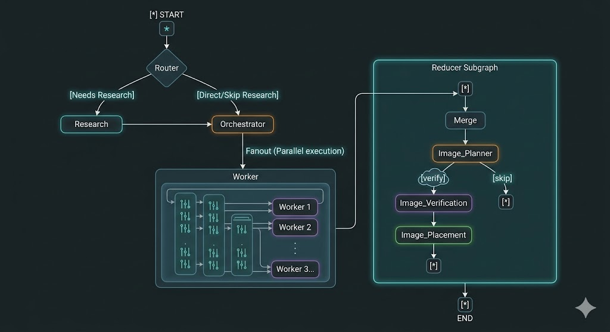

# ✍️ CRAG Blog Writer

An advanced, multi-agent AI system built with **LangGraph** that autonomously researches, plans, writes, and formats comprehensive blog posts. It utilizes a **Corrective Retrieval-Augmented Generation (CRAG)** architecture to ensure factual accuracy, dynamic web research, and parallel content generation.

## 🧠 System Architecture & Workflow

The application uses a nested graph architecture. The **Main Graph** handles the high-level routing, research, and writing delegation, while the **Reducer Subgraph** handles stitching the document together and autonomously sourcing/placing relevant images.

