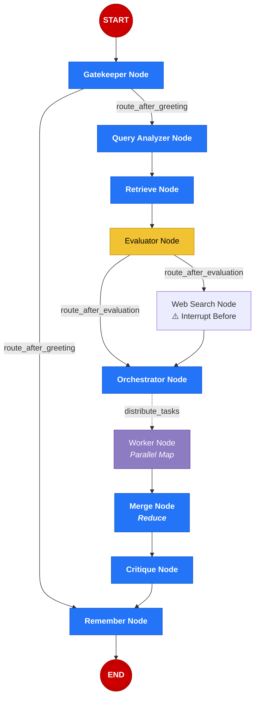

# Relay AI: Agentic IT Helpdesk Ecosystem

## 1. Project Overview
Relay AI is an advanced, multi-agent IT support system designed to automate complex technical resolutions. Built on **LangGraph**, it utilizes a sophisticated "Map-Reduce" architecture to analyze issues, retrieve relevant technical documentation from an **Azure-powered Vector Store**, and orchestrate parallel workers to generate a comprehensive incident report.

## 2. Core Architectural Components

### A. The Intent Router & Greeting Node
The entry point of the system. It identifies whether a user is looking for general conversation or reporting a technical issue.
- **LTM Integration:** It fetches Long-Term Memory (LTM) from a SQLite database to personalize the greeting (e.g., "Hello Rathan").
- **Routing:** Triggers a transition to the RAG (Retrieval-Augmented Generation) pipeline if technical intent is detected.

### B. Adaptive RAG Pipeline
Unlike standard RAG, Relay AI uses a multi-stage evaluation process:
1. **Query Optimization:** Rewrites user queries into search-optimized technical terms.
2. **Retrieval:** Pulls chunks from indexed PDFs and manuals.
3. **Evaluation:** An LLM-based auditor checks if the retrieved context is sufficient. If not, it triggers a **Human-in-the-Loop** request for a Web Search.

### C. The Orchestrator & Parallel Workers
When an issue is complex, the Orchestrator breaks the resolution into sub-tasks (e.g., Root Cause Analysis, Resolution Steps, Preventive Advice).
- **Parallel Execution:** These tasks are sent to specialized Worker Nodes simultaneously, significantly reducing latency.
- **Merging:** A Merge Node collects the results and formats them into a unified Markdown report.

### D. Multi-Tier Memory System
- **Short-Term Memory (Checkpointer):** Uses LangGraph's `MemorySaver` (or `SqliteSaver`) to maintain conversation state and handle interrupts.
- **Long-Term Memory (Fact Store):** A dedicated SQLite database that stores "Static Facts" (User identity, OS, Role) extracted by a `RememberNode`.

## 3. Key Technical Features
- **Agentic Workflows:** Cyclic graphs that can pause for human approval.
- **Vision Context:** Integrated screenshot analysis to help the agent "see" the error.
- **Azure Content Safety:** Aggressive text sanitization to bypass restrictive content filters while maintaining technical accuracy.
- **Windows-Safe File Handling:** Robust temporary file management to prevent process locking.

## 4. Technology Stack
- **Framework:** LangGraph / LangChain
- **Frontend:** Streamlit
- **LLMs:** Azure OpenAI (GPT-4o / GPT-4o-mini)
- **Vector DB:** ChromaDB / Azure AI Search
- **Database:** SQLite3

