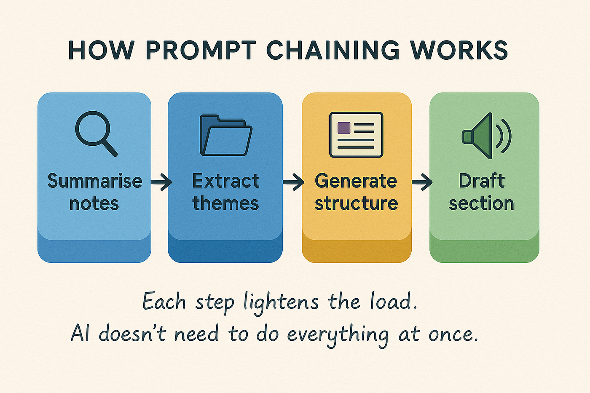
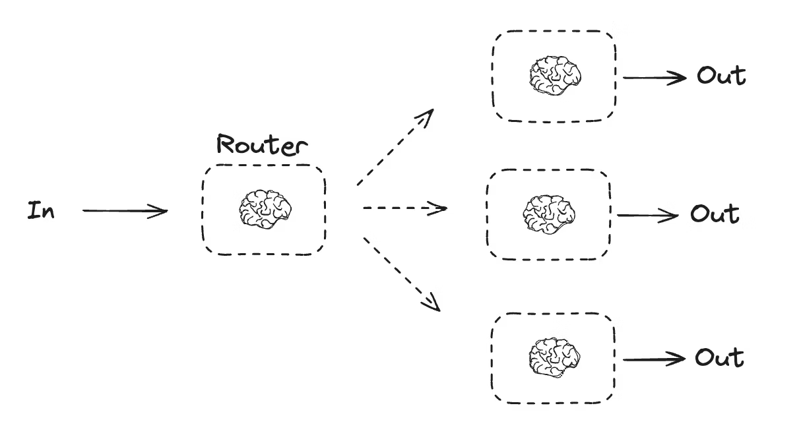
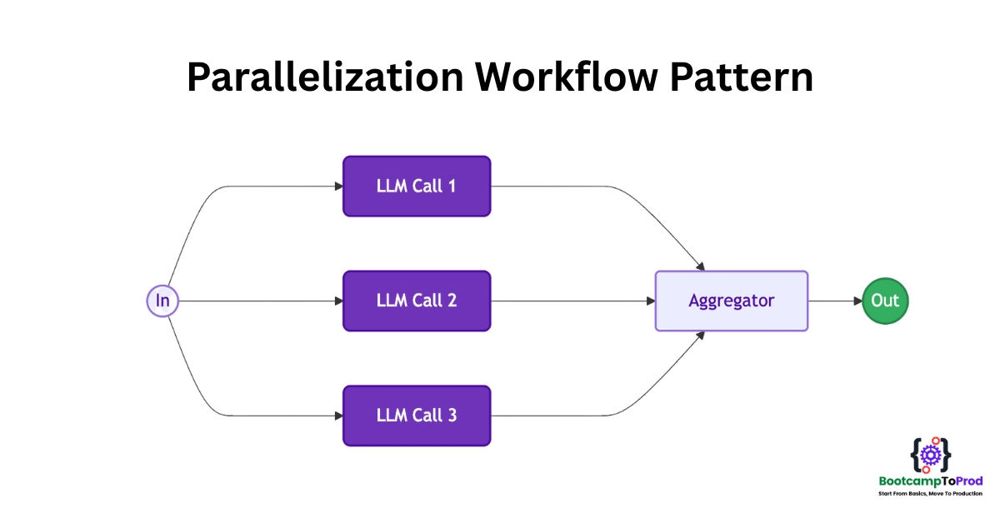
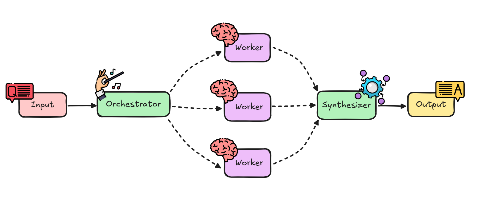
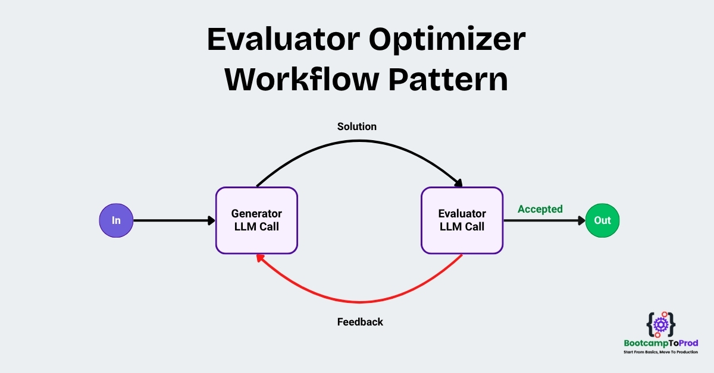
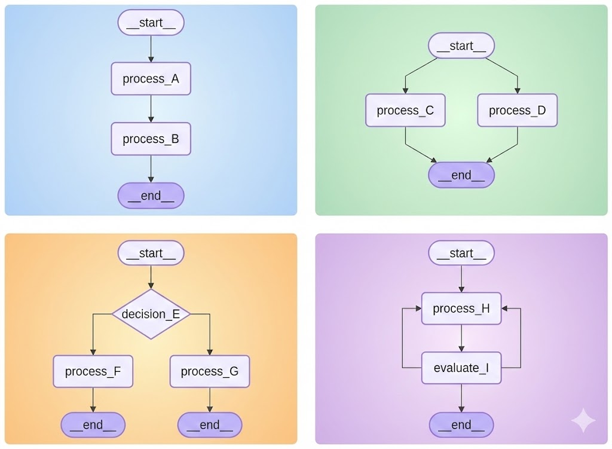
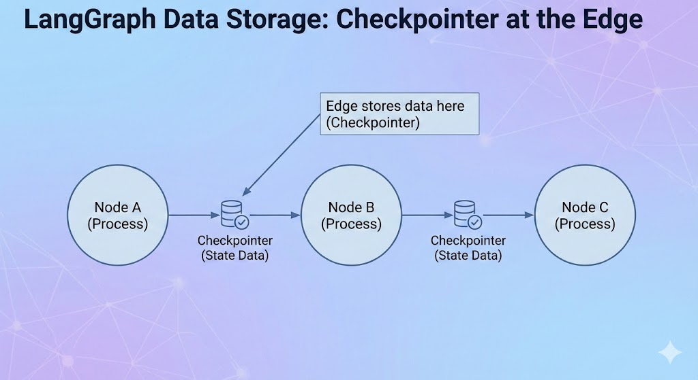

# AGENTIC AI USING LANGGRAPH 🤖🎧

## AI Agents and Generative AI

#### Generative AI (Gen AI)

-   A model designed to **create content** like text, images, code, audio, or video.
-   Works mainly as **input → output**.
-   It does not take actions or manage tasks by itself.

###### Example

**Task:** Summarize a document.
**Gen AI Output:** Returns a summary based on the input text.

------------------------------------------------------------------------

#### AI Agents

-   Systems built *on top of* Gen AI models.
-   They can **plan**, **use tools**, **interact with environments**, and **execute multi-step tasks**.
-   Designed to achieve goals autonomously.

###### Example

**Task:** "Summarize this PDF and upload it to Google Drive."

**What an AI Agent does:** 1. Reads the PDF. 2. Extracts the text. 
3. Summarizes each section. 4. Generates a final summary. 5. Saves it as a file. 
6. Uploads the file to Google Drive. 7. Sends you the link.

------------------------------------------------------------------------

#### Comparison Table

  | Feature             | Generative AI | AI Agents |
  | ------------------- | ------------- | --------- |
  | Creates content     | ✔️             | ✔️         |
  | Takes actions       | ❌             | ✔️         |
  | Uses tools          | ❌             | ✔️         |
  | Multi-step planning | Limited       | Strong    |
  | Autonomy            | Low           | High      |

------------------------------------------------------------------------

#### In Short

-   **Gen AI** creates content.
-   **AI Agents** use Gen AI + actions + tools + planning to complete
    tasks autonomously.

<hr style="border: height: 3px;background-color: #007BFF;margin: 20px auto;">

## What is Agentic AI?
Agentic AI
│
├── What it Is:
│   ├── Type of AI that completes tasks/goals autonomously [1]
│   ├── Plans, acts, adapts, seeks help when needed [1]
│   └── Proactive (vs. Reactive Generative AI) [2-4]
│
└── Key Aspects:
    ├── Characteristics (How to identify Agentic AI) [5]
    │   ├── Autonomy: Independent decision-making & action [5]
    │   │   └── Controllable via scope, HITL, override, guard rails [7]
    │   ├── Goal-Oriented: Persistent objective guides actions [8]
    │   ├── Planning: Breaks down goals into sequenced actions [10]
    │   │   └── Involves generating, evaluating, selecting plans [11, 12]
    │   ├── Reasoning: Cognitive process for interpreting, concluding, deciding [13]
    │   │   └── Needed for both planning & execution [13, 14]
    │   ├── Adaptability: Modifies plans/actions to unexpected conditions [15]
    │   │   └── Triggered by failures, external feedback, changing goals [15, 16]
    │   └── Context Awareness: Understands & retains relevant info for decisions [16]
    │       └── Implemented via Short-Term & Long-Term Memory [17, 18]
    │
    └── Components (Building Blocks of Agentic AI) [18]
        ├── Brain: The LLM, interprets goals, plans, reasons, selects tools [19]
        ├── Orchestrator: Executes the plan, manages sequencing, routing, retries [19, 20]
        ├── Tools: External world interaction (APIs, databases, knowledge bases) [20]
        ├── Memory: Retains context (Short-Term, Long-Term, state tracking) [20, 21]
        └── Supervisor: Manages Human-in-the-Loop
        
Agentic AI refers to artificial intelligence systems designed to take on tasks and goals from a user and operate autonomously, making decisions and taking actions to achieve specific goals with minimal human intervention.

- Unlike traditional AI, which relies on predefined rules and human oversight, agentic AI exhibits goal-driven behavior, adaptability, and the ability to interact dynamically with its environment.
- These systems leverage AI agents, which are machine learning models capable of mimicking human decision-making. They can perform tasks independently, coordinate with other agents in multi-agent systems, and adapt their strategies based on feedback and learning.

### Key Characteristics of Agentic AI (with Examples)
#### 🎯 Running Example
**Goal:**  
> Plan a **3-day trip to Bengaluru** within a **₹20,000 budget** and complete all bookings autonomously.

This same example is used across all characteristics.

---

#### 1. Autonomy

##### What it means
The AI agent can **make decisions and take actions independently** without needing step-by-step human instructions.

##### Example
The agent:
- Searches transport options
- Checks hotel availability
- Compares prices
- Proceeds with booking

All without repeatedly asking the user what to do next.

---

#### 2. Goal-Oriented Behavior

##### What it means
The agent works with a **persistent objective** and evaluates every action against that goal.

##### Example
The agent continuously checks:
- Is the total cost ≤ ₹20,000?
- Are travel dates satisfied?
- Is the trip duration exactly 3 days?

Hotels or transport options that violate the goal are rejected automatically.

---

#### 3. Planning

##### What it means
Breaking a high-level goal into **structured, ordered steps** before execution.

##### Example Plan
1. Decide travel dates  
2. Search transport options  
3. Select accommodation  
4. Build daily itinerary  
5. Calculate total cost  
6. Book tickets and hotel  
7. Confirm itinerary  

The agent creates this plan **before acting**.

---

#### 4. Reasoning

##### What it means
The ability to **evaluate options, compare trade-offs, and justify decisions**.

##### Example
The agent reasons:
- Flight is fast but expensive  
- Train is slow but cheap  

Decision:
> Choose train for arrival and bus for return to save ₹3,000.

The choice is made using logical comparison.

---

#### 5. Adaptability

##### What it means
The agent can **change strategy when conditions change**, while still pursuing the same goal.

##### Example
If hotel prices increase:
- Switch to a different area
- Reduce stay by one night
- Suggest hostels instead of hotels

The plan changes, but the goal remains unchanged.

---

#### 6. Context Awareness

##### What it means
The agent understands and remembers **past interactions, preferences, and current state**.

##### Example
The agent remembers:
- Preference for AC rooms
- Avoidance of early-morning travel
- Transport already booked

So it avoids irrelevant or repetitive suggestions.

---

#### 🔍 Agentic AI vs Generative AI

| Generative AI         | Agentic AI          |
| --------------------- | ------------------- |
| Responds to prompts   | Acts toward goals   |
| No memory of progress | Maintains context   |
| No planning           | Structured planning |
| No adaptation         | Dynamic adaptation  |

---

#### 🧠 Final Summary
Agentic AI systems **do not just generate responses**.  
They **act autonomously**, **plan ahead**, **reason logically**, **adapt to change**, and **use context** to complete real-world tasks effectively.

---

### Components of Agentic AI (with Example)

The below content explains the **core components of an Agentic AI system** using a **single real-world example**.


#### 🎯 Running Example
**Goal:**  
Automatically hire a **backend engineer** with 3+ years of experience.

---

#### 1. Brain (LLM)

##### What it is
The **intelligence unit** of the agent, usually a Large Language Model.

##### Responsibilities
- Understand the goal
- Reason and plan
- Decide next actions
- Interpret tool results

##### Example
The brain understands the hiring requirement and decides that a job description must be created and posted.

---

#### 2. Orchestrator

##### What it is
The **execution controller** that manages workflow.

##### Responsibilities
- Execute steps in order
- Handle loops and retries
- Decide which component runs next

##### Example
The orchestrator posts the job, waits for applications, and loops back if candidates are insufficient.

---

#### 3. Tools

##### What they are
Interfaces that allow the agent to **act in the real world**.

##### Examples
- Job portals (LinkedIn, Naukri)
- Email APIs
- Resume parsers
- Databases

##### Example
The agent uses tools to post jobs, parse resumes, and send interview emails.

---

#### 4. Memory

##### What it is
Storage for **context and learning**.

##### Types
- Short-term: current task state
- Long-term: preferences and past outcomes

##### Example
The agent remembers preferred skills and avoids previously rejected candidates.

---

#### 5. Supervisor (Human-in-the-loop)

##### What it is
A **safety and control layer**.

##### Responsibilities
- Review critical decisions
- Approve or reject actions

##### Example
Before sending offer letters, human approval is requested.

---

#### 🔄 Component Flow

User Goal → Brain → Orchestrator → Tools → Memory → Supervisor

---

#### 🧠 Summary
- Brain thinks
- Orchestrator controls
- Tools act
- Memory remembers
- Supervisor ensures safety

Together, they form a complete **Agentic AI system**.

<hr style="border: height: 3px;background-color: #007BFF;margin: 20px auto;">

## LangChain Vs LangGraph
- LangGrap0h is an graph based orchestration framework for building intelligent, stateful, and multi-step LLM workflows
- It enables advanced featues like parallelism, loops, branching, memory, and resumability - making it ideal for agentic and production grade AI applications
- It models your logic as a graph of nodes (tasks) and edges (routing) instead of linear chain.

It allows you to define:
- **Nodes** → actions (LLM calls, tools, logic)
- **Edges** → control flow between actions
- **State** → shared memory passed across steps
---

### LLM Workflows
- Step by step process using which we build complex LLM applications
- Each step in a workflow performs a distint task - such as prompting, reasoning, tool calling, memory access, or decision making.
- Workflows can be linear, parallel, branched, or looped.

**Common Workflows:**
- Prompt Chaining
- Routing
- Parallelization
- Orchestrator Workers
- Evaluator Optimizer

### Why LangGraph Exists

Traditional agent frameworks struggle with:
- Infinite or uncontrolled loops
- Hard-to-debug execution
- Poor visibility into decision flow
- Limited support for retries and human approval

LangGraph solves these problems by making agent execution **explicit, deterministic, and inspectable**.

---

### Core Concepts

#### 1. Nodes

Each node represents a **unit of work**, usually a function.

Examples:
- Call an LLM
- Use a tool (search, database, API)
- Validate output
- Ask for human approval

Conceptually:
```
Think → Search → Decide → Act
```

---

#### 2. Edges

Edges define **what runs next** after a node.

Types:
- Normal edge (A → B)
- Conditional edge (if / else)
- Loop edge (retry, replan)

Example:
```
If confidence < 0.7 → Re-think
Else → Act
```

---

#### 3. State

State is a **shared object** passed between nodes.

Example state:
```json
{
  "goal": "Answer user query",
  "plan": [],
  "tool_result": null,
  "approved": false
}
```

State acts as:
- Memory
- Progress tracker
- Context store

---

#### 4. Deterministic Control

LangGraph lets you explicitly define:
- When the agent stops
- When it retries
- When it branches
- When it asks for human approval

This avoids uncontrolled LLM loops.

---

### Example Flow (Conceptual)

**Goal:** Answer a user question with verification.

```
Start
 ↓
LLM (reason)
 ↓
Search Tool
 ↓
LLM (verify)
 ↓
If confident → Final Answer
Else → Loop back to LLM
```

This structure is natural and safe in LangGraph.

---

### LangGraph vs LangChain

| Aspect          | LangChain     | LangGraph      |
| --------------- | ------------- | -------------- |
| Execution model | Linear chains | Graph-based    |
| Loops           | Limited       | Native support |
| Branching       | Basic         | First-class    |
| State handling  | Minimal       | Strong         |
| Agent control   | Implicit      | Explicit       |
| Debuggability   | Medium        | High           |

LangGraph builds **on top of LangChain**, it does not replace it.

---

### LangGraph in Agentic AI Architecture

| Agentic Component | LangGraph Role   |
| ----------------- | ---------------- |
| Brain             | LLM node         |
| Orchestrator      | LangGraph engine |
| Tools             | Tool nodes       |
| Memory            | Graph state      |
| Supervisor        | Approval nodes   |

LangGraph primarily acts as the **orchestrator**.

---

### When to Use LangGraph

#### Use it when:
- Your agent needs loops or retries
- You need human-in-the-loop approval
- You want predictable execution
- You are building production agents

#### Avoid it when:
- Task is a simple one-shot prompt
- Linear flow is sufficient

---

### 🧠 One-Line Summary

**LangGraph enables agentic AI systems with explicit control, memory, and safety—similar to how backend workflows are designed.**

<hr style="border: height: 3px;background-color: #007BFF;margin: 20px auto;">


## LangGraph Core Concepts
### LLM workflow patterns
#### 1. Prompt Chaining
**What it is**
Breaking a complex task into multiple sequential LLM prompts, where each output feeds the next.

**Why it exists**
- Improves accuracy
- Makes reasoning explicit
- Easier debugging

**Example**
Task: Write a technical blog

**Steps:**
- Generate outline
- Expand sections
- Polish language

``` text
  Input
  ↓
  Prompt 1 (Outline)
  ↓
  Prompt 2 (Expand)
  ↓
  Prompt 3 (Refine)
  ↓
  Final Output
```



#### 2. Routing
**What it is**
Classifying input and routing it to the correct prompt, model, or tool.

**Important correction**
Routing is not reasoning — it’s decision-based dispatching.

**Example**
- Customer query handling:
- Billing question → Finance prompt
- Bug report → Tech support prompt
- General query → FAQ prompt

``` text
    User Input
      ↓
    Classifier (LLM / rules)
      ↓
    ┌────────────┬────────────┬────────────┐
    ↓            ↓            ↓
    Billing     Tech        General
    Prompt      Prompt      Prompt
```



#### 3. Parallelization
**What it is**
Running multiple LLM calls simultaneously and combining results.

**Why it’s used**
- Speed
- Diversity of answers
- Cross-validation

**Characteristics**
- No decision-making
- No task breakdown
- Same input → multiple executions
- Fire-and-forget

**Example**
Analyze a document for:
- Summary
- Risks
- Key points
All at the same time.

```text
    Input
      ↓
    ┌─────────┬─────────┬─────────┐
    ↓         ↓         ↓
    LLM A    LLM B     LLM C
    ↓         ↓         ↓
    └────── Merge Results ──────┘
                ↓
            Final Output
```

✅ Fast
✅ Robust
❌ Needs merge logic

#### 4. Orchestrator–Workers Pattern
**What it is**
One controller (orchestrator) delegates tasks to multiple worker LLMs.

**Key correction**
Workers do not decide the goal — the orchestrator does.

**A central orchestrator:**
- Understands the goal
- Breaks it into tasks
- Assigns tasks to workers
- Collects and integrates results

**Example**
Task: Code review

- Orchestrator splits work
- Workers review different aspects
- Orchestrator merges feedback

```text
                Orchestrator
                      ↓
        ┌─────────────┼─────────────┐
        ↓             ↓             ↓
   Worker A       Worker B       Worker C
 (Logic)         (Style)        (Security)
        ↓             ↓             ↓
        └────────── Results ─────────┘
                      ↓
                 Final Output
```

✅ Scalable
✅ Clean separation of concerns

#### 5. Evaluator–Optimizer Pattern
**What it is**
A feedback loop where one LLM generates output and another evaluates it.

**Critical distinction**
Evaluator never generates
Optimizer never judges

**Example**
Improve an answer until quality threshold is met.

```text
  Prompt
    ↓
  Optimizer (Generate)
    ↓
  Evaluator (Score)
    ↓
  Score OK?
  ├── Yes → Final Answer
  └── No  → Feedback → Optimizer
```

This is controlled looping, not autonomous behavior.

## Workflows
### 1.Sequential Workflows: 
  Tasks are executed one after another in a specific, linear order.

### 2.Parallel Workflows: 
  Multiple tasks are executed simultaneously across different branches.

### 3.Conditional Workflows: 
  The path of execution is determined by a decision or criteria, leading to different outcomes.

### 4.Iterative Workflows: 
  A set of tasks is repeated multiple times in a loop until a specific condition is met.



## Langgraph Persistant
### 1.Saves State: 
  Allows AI agents to save and retrieve their state throughout a workflow instead of forgetting data once a task ends.

### 2.Checkpointing System: 
  Implements a system where every intermediate step is securely stored in a database.

### 3.Fault Tolerance: 
  Ensures systems can resume from the exact point of a crash rather than starting over.

### 4.Short-Term Memory: 
  Enables chatbots to remember context, allowing users to revisit past conversations via unique thread IDs.

### 5.Human-in-the-Loop: 
  Allows processes to pause for manual human approval before continuing.

### 6.Time Travel: 
  Facilitates debugging by allowing developers to revisit specific execution points in the past.

### 7.Enhanced Development: 
  empowers the creation of more reliable, complex, and interactive AI applications.
