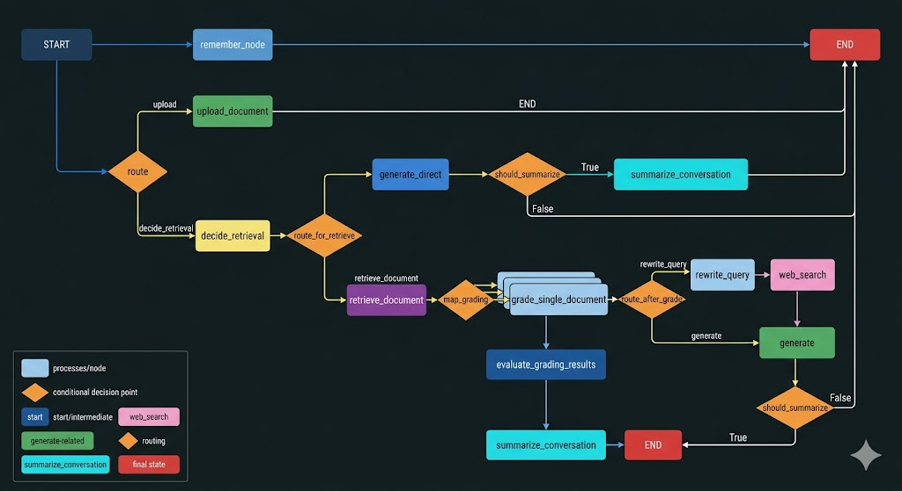

# 📚 Custom NotebookLM (Agentic RAG System)

An open-source, locally hosted alternative to Google's NotebookLM. This project allows you to ingest YouTube videos, store their transcripts in a local vector database, and converse with them using an advanced Agentic Retrieval-Augmented Generation (RAG) workflow built with LangGraph.

This project features persistent chat memory, web search fallbacks, and a decoupled Model Context Protocol (MCP) architecture.

## ✨ Key Features

* **🎬 YouTube Knowledge Base:** Paste a YouTube URL to automatically extract, chunk, and embed the video's transcript.
* **🧠 Agentic RAG (CRAG & Adaptive):** * **Adaptive Routing:** The agent decides if it needs to search the database or if it can answer conversational questions directly (saving tokens and time).
    * **Corrective Fallback:** If the vector database returns irrelevant context, the agent automatically rewrites your query and searches the live web (DuckDuckGo).
* **💾 Persistent Memory:** Uses a local PostgreSQL database (via Docker) and LangGraph's native checkpointer to remember your conversation history across sessions.
* **🔌 MCP Architecture:** The YouTube extraction logic runs as a standalone Model Context Protocol (MCP) server, completely decoupling the tool from the main LLM logic.
* **⚡ Local Embeddings:** Uses HuggingFace `all-MiniLM-L6-v2` to generate vector embeddings entirely on your local machine, avoiding API rate limits.
* **🎨 Streamlit UI:** A clean, responsive chat interface with a sidebar for managing your knowledge base.

---

## 🏗️ Architecture

The core of this project is a `StateGraph` powered by LangGraph. It routes requests intelligently:

1.  **Upload Flow:** Extracts transcripts via the MCP server -> Splits into chunks -> Embeds locally -> Saves to ChromaDB.
2.  **Chat Flow:**
    * `decide_retrieval`: Evaluates if the question needs external facts.
    * `retrieve_document`: Fetches semantic matches from ChromaDB.
    * `grade_single_document`: Evaluates if the retrieved chunks actually answer the question.
    * `web_search`: (Fallback) Searches DuckDuckGo if the database fails.
    * `generate`: Compiles the final answer using the LLM.

---

## 🛠️ Tech Stack

* **Orchestration:** [LangGraph](https://langchain-ai.github.io/langgraph/) / LangChain
* **Frontend:** [Streamlit](https://streamlit.io/)
* **Vector Database:** [ChromaDB](https://www.trychroma.com/) (Local)
* **Memory/Checkpointer:** PostgreSQL (Docker) + `psycopg-pool`
* **Embeddings:** HuggingFace (`all-MiniLM-L6-v2`)
* **LLM Providers:** Google Gemini (`gemini-2.5-flash`) / Groq (`llama-3.1-8b-instant`)
* **Package Manager:** `uv`
* **Tooling Protocol:** FastMCP

---

## 🚀 Getting Started

### 1. Prerequisites
* Python 3.10+
* [uv](https://github.com/astral-sh/uv) package manager installed.
* [Docker](https://www.docker.com/) installed and running.
* API Keys for your chosen LLM (e.g., `GOOGLE_API_KEY` or `GROQ_API_KEY`).

### 2. Environment Setup
Clone the repository and set up your `.env` file in the root directory:
```env
GOOGLE_API_KEY=your_google_gemini_api_key
# GROQ_API_KEY=your_groq_api_key
```


